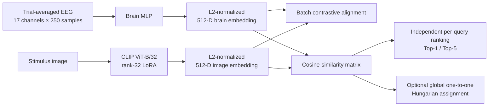

# EEG-to-Image Retrieval with Joint Brain–Vision Alignment

Course project for **AIAA3800 — Human-Centered Artificial Intelligence**.

This repository studies whether non-invasive EEG recordings can be mapped into a visual-semantic embedding space and used to retrieve the image that a person viewed. The current verified experiment aligns a trainable brain encoder with a LoRA-adapted CLIP vision encoder on **THINGS-EEG2 Subject 08**, then compares standard independent retrieval with an optional global one-to-one Hungarian decoder.

> **Scope.** The verified numbers in this README cover one subject (`sub-08`) and one seed (`42`). They are not a ten-subject average.

## Highlights

- Maps trial-averaged posterior EEG signals to the 512-dimensional CLIP image space.
- Jointly trains a brain MLP and rank-32 LoRA adapters on CLIP ViT-B/32.
- Uses different learning rates for the brain and vision branches (TTUR-style optimization).
- Reports a fixed final-checkpoint result rather than selecting the best test epoch.
- Includes deterministic per-query evaluation and an audited Hungarian one-to-one assignment ablation.
- Provides unit tests, independent checkpoint-reload checks, per-query predictions, and similarity-matrix provenance.

## Method



For EEG query embedding $b_i$ and gallery image embedding $v_j$, both L2-normalized, the retrieval score is

$$
S_{ij} = b_i^\top v_j.
$$

Standard retrieval ranks each row independently:

$$
\hat{j}_i = \operatorname*{arg\,max}_{j} S_{ij}.
$$

The optional Hungarian decoder instead solves one global bijection:

$$
\hat{\pi} = \operatorname*{arg\,max}_{\pi \in \mathrm{Perm}(N)}
\sum_{i=1}^{N} S_{i,\pi(i)}.
$$

The second protocol can assign an image that is not a query's row-wise maximum because it optimizes the complete one-to-one matching.

## Verified Results

The official result uses the saved model after epoch 25 and an independent save/reload evaluation over 200 held-out queries and 200 unique gallery images.

| Evaluation protocol | Top-1 / assignment accuracy | Top-5 |
|---|---:|---:|
| Standard independent per-query retrieval | **182/200 (91.0%)** | **199/200 (99.5%)** |
| Global Hungarian one-to-one assignment | **200/200 (100.0%)** | N/A |

The random 200-way baselines are 0.5% Top-1 and 2.5% Top-5.

### Interpreting the Hungarian result

The Hungarian result is a **transductive closed-set ablation**, not a replacement for standard Top-1:

- it jointly observes the full test query batch;
- it assumes that the 200 queries and 200 gallery images form a known bijection;
- every gallery image must be used exactly once;
- a single global assignment returns one image per query, so it has no directly comparable Top-5.

In this run, independent Top-1 predictions covered only 183 unique gallery images. Hungarian decoding changed 18 assignments, converting all 18 standard Top-1 errors to correct matches without changing any correct match to an error. Nine predeclared row/column orderings produced the same mapped assignment, ruling out an aligned-order tie-break explanation for the 100% result.

The recommended reporting convention is therefore:

- **Primary result:** standard Top-1 91.0%, standard Top-5 99.5%.
- **Secondary ablation:** global one-to-one assignment accuracy 100.0%.

## Experiment Configuration

| Component | Setting |
|---|---|
| Dataset | THINGS-EEG2 |
| Verified subject / seed | `sub-08` / `42` |
| Loaded train EEG tensor | `(16540, 4, 63, 250)` |
| Loaded test EEG tensor | `(200, 80, 63, 250)` |
| Trial handling | Average 4 train trials and 80 test trials separately |
| EEG channels | `P7,P5,P3,P1,Pz,P2,P4,P6,P8,PO7,PO3,POz,PO4,PO8,O1,Oz,O2` |
| Time window | `[0, 250)` samples |
| Brain encoder | MLP with residual projection blocks |
| Vision encoder | CLIP ViT-B/32 |
| Vision adaptation | LoRA rank 32, all linear layers |
| Embedding dimension | 512 |
| Brain / vision learning rates | `5e-4` / `5e-5` |
| Scheduler / weight decay | Cosine / `0.05` |
| Train / evaluation batch size | 512 / 100 |
| Training | 25 epochs, bf16, gradient checkpointing |
| Formal hardware | One NVIDIA A40 |

## Repository Layout

```text
.
├── main/
│   ├── data.py                     # THINGS-EEG/image loading and ID matching
│   ├── models_brain.py             # EEG encoder backbones
│   ├── models_clip.py              # Brain–CLIP alignment model
│   └── models_diffusion.py         # Experimental reconstruction components
├── scripts/
│   ├── evaluate_retrieval.py       # Standard and Hungarian evaluation
│   ├── finalize_results.py         # Standard-result validation/reporting
│   ├── finalize_hungarian_results.py
│   ├── run_sub08_reproduction.sh   # Site-specific reproduction wrapper
│   ├── run_hungarian_evaluation.sh # Site-specific Hungarian wrapper
│   └── submit_*.slurm              # HKUST(GZ) SLURM launchers
├── tests/
│   └── test_hungarian_assignment.py
├── docs/                            # Internal technical notes
├── train_clip_lora.py               # Main training entry point
├── vanilla.py                       # Experimental reconstruction path
├── enhance.py                       # Experimental retrieval refinement
└── graph.py                         # Experimental graph-based refinement
```

Generated checkpoints, caches, logs, plans, and result artifacts are intentionally excluded by `.gitignore`.

## Environment Setup

Run the commands in this section from the repository root. The formal experiment used Linux, one NVIDIA A40, and the following fully tested software stack:

| Package | Tested version |
|---|---:|
| Python | 3.10.20 |
| PyTorch | 2.11.0 + CUDA 12.8 |
| TorchVision | 0.26.0 + CUDA 12.8 |
| Transformers | 5.12.1 |
| Datasets | 5.0.0 |
| Accelerate | 1.14.0 |
| PEFT | 0.19.1 |
| Diffusers | 0.38.0 |
| Safetensors | 0.8.0 |
| NumPy | 2.2.6 |
| SciPy | 1.15.3 |
| Pillow | 12.2.0 |
| tqdm | 4.68.3 |
| einops | 0.8.2 |

`diffusers` is part of the core environment because `main/models_clip.py` imports one of its model classes even when only retrieval is run. SciPy is required by the evaluation entry point and provides the Hungarian solver.

### Option A: reuse the verified cluster environment

On the project cluster, `eeg_recon` is the environment used to produce the reported metrics. If Conda is available in the current shell, activate it directly:

```bash
source "$(conda info --base)/etc/profile.d/conda.sh"
conda activate eeg_recon

python --version
which python
```

No additional installation is needed for standard or Hungarian retrieval. The existing `test` environment is **not** recommended for the formal run: its package versions differ from the table above and it currently has a `libstdc++`/`GLIBCXX` import conflict on the cluster.

To preserve `eeg_recon` unchanged while creating a separate working copy:

```bash
conda create --name eeg-retrieval --clone eeg_recon -y
conda activate eeg-retrieval
```

### Option B: create the tested environment from scratch

Create a clean Conda environment, install the matching CUDA 12.8 PyTorch wheels first, and then install the remaining pinned dependencies:

```bash
conda create --name eeg-retrieval python=3.10.20 pip -y
conda activate eeg-retrieval
python -m pip install --upgrade pip

python -m pip install \
  torch==2.11.0 torchvision==0.26.0 \
  --index-url https://download.pytorch.org/whl/cu128

python -m pip install \
  transformers==5.12.1 \
  datasets==5.0.0 \
  accelerate==1.14.0 \
  peft==0.19.1 \
  diffusers==0.38.0 \
  safetensors==0.8.0 \
  numpy==2.2.6 \
  scipy==1.15.3 \
  Pillow==12.2.0 \
  tqdm==4.68.3 \
  einops==0.8.2
```

The CUDA wheel must match the target machine's NVIDIA driver. If CUDA 12.8 is unsuitable, select a compatible PyTorch build from the [official installation guide](https://pytorch.org/get-started/locally/) and keep the remaining package versions pinned. Do not mix independently selected PyTorch and TorchVision builds.

### Verify the installation

Run this import check before submitting a training job:

```bash
python - <<'PY'
import sys

import accelerate
import datasets
import diffusers
import peft
import scipy
import torch
import torchvision
import transformers
from scipy.optimize import linear_sum_assignment

from main.models_clip import BrainCLIPModel

print("Python:", sys.version.split()[0])
print("PyTorch:", torch.__version__)
print("TorchVision:", torchvision.__version__)
print("Transformers:", transformers.__version__)
print("Datasets:", datasets.__version__)
print("Accelerate:", accelerate.__version__)
print("PEFT:", peft.__version__)
print("Diffusers:", diffusers.__version__)
print("SciPy:", scipy.__version__)
print("Compiled CUDA:", torch.version.cuda)
print("CUDA visible on this node:", torch.cuda.is_available())
if torch.cuda.is_available():
    print("GPU:", torch.cuda.get_device_name(0))
print("Core retrieval imports: OK")
PY

python -m unittest discover -s tests -v
```

`CUDA visible on this node: False` is expected on a login node without an allocated GPU. Repeat the check inside the SLURM GPU allocation before training; the formal run should report the assigned A40. The single-GPU reproduction command below uses one `torchrun` process, so running `accelerate launch` with the repository's two-process `accelerate_config.yaml` is not equivalent.

### Optional reconstruction dependencies

The standard and Hungarian retrieval results do not require the experimental reconstruction utilities. To use `vanilla.py`, `enhance.py`, `graph.py`, or the reconstruction metrics, also install:

```bash
python -m pip install \
  scikit-image==0.25.2 \
  clip-anytorch==2.6.0
```

Those paths also require separately downloaded SDXL/IP-Adapter weights. Experiment trackers such as Weights & Biases, SwanLab, or TensorBoard are optional and are only needed when selected through `--report_to`.

## Data and Pretrained Model

The dataset and model weights are not distributed in this repository.

Download THINGS-EEG2 from the [THINGS initiative](https://things-initiative.org/) or its [OSF repository](https://osf.io/3jk45/), then prepare the 250 Hz whitened files expected by the loader:

```text
things_eeg_data/
├── Preprocessed_data_250Hz_whiten/
│   └── sub-08/
│       ├── train.pt
│       └── test.pt
├── training_images/
│   └── **/*.jpg
└── test_images/
    └── **/*.jpg
```

The CLIP model must be available in a local Hugging Face-compatible directory containing its configuration, image processor, and weights, for example:

```text
CLIP-ViT-B-32-laion2B-s34B-b79K/
├── config.json
├── preprocessor_config.json
└── model.safetensors
```

Set portable paths before running:

```bash
export PROJECT_ROOT="$(pwd)"
export THINGS_ROOT="/path/to/things_eeg_data"
export BRAIN_DIR="$THINGS_ROOT/Preprocessed_data_250Hz_whiten"
export CLIP_PATH="/path/to/CLIP-ViT-B-32-laion2B-s34B-b79K"
export OUTPUT_DIR="$PROJECT_ROOT/runs/seed42/subj08"
export RESULTS_DIR="$PROJECT_ROOT/results"
export CHANNELS="P7,P5,P3,P1,Pz,P2,P4,P6,P8,PO7,PO3,POz,PO4,PO8,O1,Oz,O2"

mkdir -p "$OUTPUT_DIR/cache" "$RESULTS_DIR"
```

For a fully offline run:

```bash
export HF_DATASETS_OFFLINE=1
export TRANSFORMERS_OFFLINE=1
export HF_HUB_OFFLINE=1
export TOKENIZERS_PARALLELISM=false
export CUBLAS_WORKSPACE_CONFIG=:4096:8
```

## Training

The following command reproduces the Subject 08 configuration without relying on the site-specific wrapper paths:

```bash
torchrun --standalone --nnodes=1 --nproc-per-node=1 \
  train_clip_lora.py \
  --dataset_name things \
  --brain_directory "$BRAIN_DIR" \
  --image_directory "$THINGS_ROOT" \
  --cache_dir "$OUTPUT_DIR/cache" \
  --subject_ids 8 \
  --eval_subject_ids 8 \
  --brain_column eeg \
  --brain_backbone brain_mlp \
  --dropout 0.1 \
  --pretrained_model_name_or_path "$CLIP_PATH" \
  --lora_rank 32 \
  --lora_layers all-linear \
  --gradient_checkpointing \
  --time_slice 0,250 \
  --avg_trials \
  --selected_channels "$CHANNELS" \
  --learning_rate 5e-4 \
  --vision_learning_rate 5e-5 \
  --lr_scheduler_type cosine \
  --weight_decay 0.05 \
  --seed 42 \
  --dataloader_num_workers 8 \
  --mixed_precision bf16 \
  --output_dir "$OUTPUT_DIR" \
  --metrics_jsonl "$OUTPUT_DIR/validation_metrics.jsonl" \
  --save_total_limit 1 \
  --checkpointing_steps epoch \
  --validation_steps epoch \
  --num_train_epochs 25 \
  --per_device_train_batch_size 512 \
  --per_device_eval_batch_size 100
```

Run a one-step or one-epoch smoke test before the formal job if using new hardware or a newly prepared dataset.

## Evaluation

Define the common evaluation arguments in Bash:

```bash
EVAL_ARGS=(
  --brain-model-path "$OUTPUT_DIR/brain_model"
  --vision-adapter-path "$OUTPUT_DIR/vision_model"
  --pretrained-model-name-or-path "$CLIP_PATH"
  --brain-directory "$BRAIN_DIR"
  --image-directory "$THINGS_ROOT"
  --dataset-name things
  --subject-id 8
  --selected-channels "$CHANNELS"
  --time-slice 0,250
  --batch-size 100
  --num-workers 0
  --device cuda
  --dtype bf16
  --cache-dir "$OUTPUT_DIR/cache"
  --seed 42
  --expected-num-samples 200
  --local-files-only
)
```

### Standard independent retrieval

```bash
python scripts/evaluate_retrieval.py \
  "${EVAL_ARGS[@]}" \
  --metrics-output "$RESULTS_DIR/sub08_standard_metrics.json" \
  --predictions-output "$RESULTS_DIR/sub08_standard_predictions.csv"
```

### Hungarian one-to-one ablation

The evaluator still writes the standard per-query metrics, while adding a separate constrained-assignment namespace and CSV:

```bash
python scripts/evaluate_retrieval.py \
  "${EVAL_ARGS[@]}" \
  --enable-hungarian \
  --metrics-output "$RESULTS_DIR/sub08_hungarian_metrics.json" \
  --predictions-output "$RESULTS_DIR/sub08_hungarian_standard_predictions.csv" \
  --hungarian-output "$RESULTS_DIR/sub08_hungarian_assignment.csv" \
  --similarity-output "$RESULTS_DIR/sub08_cosine_similarity.npz"
```

Do not label `assignment_accuracy` as standard Top-1, and do not invent a Hungarian Top-5 for a single global assignment.

## Tests

```bash
python -m unittest -v tests/test_hungarian_assignment.py
```

The tests cover solver optimality, collision resolution, invalid matrices, non-diagonal ID mappings, and row/column permutation invariance for a unique optimum.

## SLURM Wrappers

The repository includes launchers used on the HKUST(GZ) cluster:

```bash
sbatch scripts/submit_sub08.slurm smoke
sbatch scripts/submit_sub08.slurm formal
sbatch scripts/submit_hungarian_eval.slurm
```

These shell and SLURM files currently contain site-specific absolute paths. Before using them in another clone or cluster, update:

- `PROJECT_ROOT`, `THINGS_ROOT`, `BRAIN_DIR`, and `CLIP_PATH`;
- `#SBATCH --chdir`, `--output`, and `--error`;
- the Conda activation path and environment name;
- partition, GPU, CPU, memory, and time requests.

The direct training and evaluation commands above are the portable reference commands.

## Reproducibility Policy

- The official metric is evaluated from the fixed final checkpoint after epoch 25.
- Test-set peak epochs are diagnostic only and are not used for checkpoint selection.
- Query and gallery identity are matched by unique image ID rather than by assuming a diagonal target.
- Standard evaluation is repeated after independent model reloads.
- Hungarian evaluation saves the full similarity matrix, ID ordering, hashes, transition ledger, and assignment output.
- Ground-truth labels are used only after the assignment is solved; they are not part of the Hungarian objective.
- Multiple predeclared row/column orderings are audited so aligned input order cannot silently determine an exact tie.

## Limitations and Responsible Use

- Results currently cover one subject and one random seed.
- Trial averaging uses repeated presentations and is not equivalent to single-trial decoding.
- Hungarian decoding requires the complete query batch and a known one-to-one gallery prior, so it is not an online single-query retrieval protocol.
- Dataset, preprocessing, and model-weight versions can materially affect the result.
- The reconstruction path is experimental; no formal reconstruction metric is claimed in this README.
- EEG is sensitive human-participant data. Follow the dataset's consent, privacy, licensing, and redistribution requirements, and do not interpret this research system as a clinical or diagnostic tool.

## References

- Gifford, A. T., Dwivedi, K., Roig, G., & Cichy, R. M. (2022). [A large and rich EEG dataset for modeling human visual object recognition](https://doi.org/10.1016/j.neuroimage.2022.119754). *NeuroImage, 264*, 119754.
- Song, Y., Liu, B., Li, X., Shi, N., Wang, Y., & Gao, X. (2024). [Decoding Natural Images from EEG for Object Recognition](https://openreview.net/forum?id=dhLIno8FmH). *ICLR 2024*. Code: [NICE-EEG](https://github.com/eeyhsong/NICE-EEG).
- Li, D., Wei, C., Li, S., Zou, J., & Liu, Q. (2024). [Visual Decoding and Reconstruction via EEG Embeddings with Guided Diffusion](https://proceedings.neurips.cc/paper_files/paper/2024/hash/ba5f1233efa77787ff9ec015877dbd1f-Abstract-Conference.html). *NeurIPS 2024*. Code: [EEG Image Decode](https://github.com/dongyangli-del/EEG_Image_decode).

## License

No open-source license has been declared for this course-project repository. Add an explicit license before redistributing the code or accepting external contributions.
