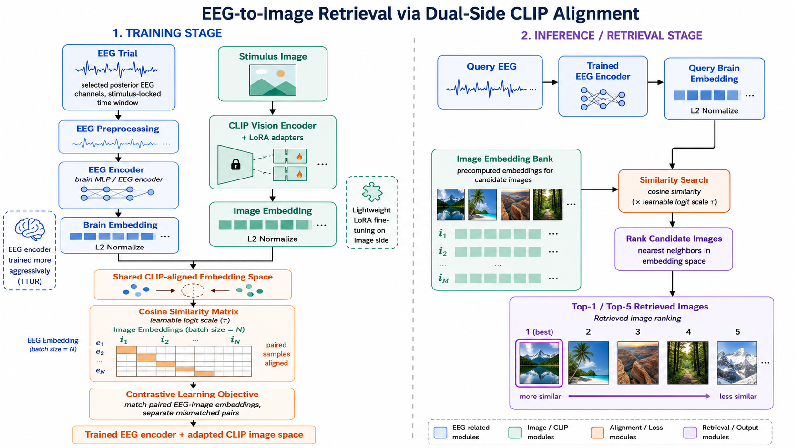
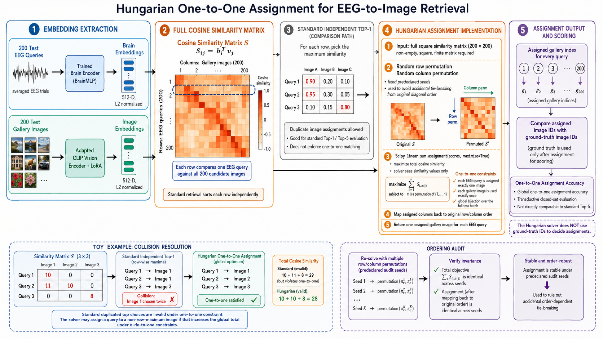

# EEG-to-Image Retrieval with Joint Brain–Vision Alignment

English | [简体中文](README_ZH.md)

Course project for **AIAA3800 — Human-Centered Artificial Intelligence**.

This repository studies whether non-invasive EEG recordings can be mapped into a visual-semantic embedding space and used to retrieve the image that a person viewed. The original formal protocol trains a separate brain encoder and LoRA-adapted CLIP vision encoder for each of the ten THINGS-EEG2 subjects (`sub-01` through `sub-10`) at each of five seeds (`42` through `46`). A controlled SAMGA experiment isolates the effect of applying the same visual LoRA/TTUR intervention to an otherwise identical frozen-CLIP SAMGA control. A third, separate track performs an audited best-effort reproduction with the released SAMGA training code and pinned inferred InternViT V2.5 features. A dedicated matching-fairness suite compares Independent, Greedy, Hungarian, Stable Matching, and Sinkhorn decoding on NICE, ATM-S, and Our project under identical seed-42 Subject-08 standard and perturbed query/gallery scenarios.

> **Scope.** The original headline result covers a complete 10-subject × 5-seed grid: seeds `42`, `43`, `44`, `45`, and `46`, with 50 independently trained subject–seed models. The controlled SAMGA extension adds 50 matched Frozen models and 50 matched LoRA models on the same grid. The public-code reproduction separately evaluates released-launcher seed `2025` and a project-defined fixed-60 stability grid at seeds `42`–`46`; the latter are not claimed to be the paper's undisclosed seeds. Results remain separate because the paper does not publish its exact visual checkpoint, extractor, five seed values, or checkpoint-selection rule. The matching-fairness suite covers only seed `42` / `sub-08`; all global-assignment values are secondary transductive ablations and are excluded from every standard multi-subject aggregate.

> **Reproduction guide.** For pinned assets, executable commands, complete
> protocol details, and claim boundaries, see the
> [English SAMGA public-code reproduction guide](experiments/samga_reproduction/README.md).

## Highlights

- Maps trial-averaged posterior EEG signals to the 512-dimensional CLIP image space.
- Jointly trains a brain MLP and rank-32 LoRA adapters on CLIP ViT-B/32.
- Uses different learning rates for the brain and vision branches (TTUR-style optimization).
- Reports a fixed final-checkpoint result for every subject–seed run rather than selecting the best test epoch.
- Trains and evaluates all 50 subject–seed models independently, then reports both per-seed ten-subject and five-seed standard Top-1/Top-5 aggregates.
- Runs a pre-registered 50-pair SAMGA Frozen-versus-LoRA attribution study with matched task initialization and a sealed concept-disjoint pilot validation split.
- Audits the released SAMGA source, pins an inferred InternViT V2.5 revision, and reports fixed/final and test-selected metrics under explicitly different labels.
- Provides unit tests, independent checkpoint-reload checks, and per-query predictions for every standard run, plus hash-bound similarity-matrix provenance for the three-baseline seed-42 / `sub-08` matching-fairness suite.

## Method



For EEG query embedding $b_i$ and gallery image embedding $v_j$, both L2-normalized, the retrieval score is

```math
S_{ij} = b_i^\top v_j.
```

Standard retrieval ranks each row independently:

```math
\hat{j}_i = \underset{j}{\arg\,\max}\; S_{ij}.
```

The optional Hungarian decoder instead solves one global bijection:

```math
\hat{\pi} = \underset{\pi \in \mathrm{Perm}(N)}{\arg\,\max}
\sum_{i=1}^{N} S_{i,\pi(i)}.
```

The second protocol can assign an image that is not a query's row-wise maximum because it optimizes the complete one-to-one matching.

## Verified Results

### Five-seed, ten-subject standard independent retrieval

The formal study covers seeds `42`, `43`, `44`, `45`, and `46`. Each of the 50 subject–seed combinations has a separately trained model, uses the fixed checkpoint saved after epoch 25, and evaluates 200 held-out EEG queries against 200 unique gallery images. Every run passed strict artifact validation and an independent checkpoint-reload repeat check with identical metrics and per-query predictions.

The primary result is:

- Top-1: **86.66% ± 0.69 percentage points**;
- Top-5: **98.38% ± 0.14 percentage points**;
- pooled counts: Top-1 **8666/10000** and Top-5 **9838/10000**.

The ± term is the sample SD (`ddof=1`) across the five seed-level ten-subject macro accuracies. Because every subject–seed run contains 200 queries, the five-seed mean equals the pooled accuracy. The 10,000 query evaluations repeat each subject's same held-out stimulus set across five seeds; they are not 10,000 independent test examples. The random 200-way baselines are 0.5% Top-1 and 2.5% Top-5.

#### Per-seed ten-subject means

| Seed | Top-1 | Top-5 | Correct@1 | Correct@5 |
|---:|---:|---:|---:|---:|
| 42 | 87.35% | 98.30% | 1747/2000 | 1966/2000 |
| 43 | 85.60% | 98.35% | 1712/2000 | 1967/2000 |
| 44 | 87.10% | 98.20% | 1742/2000 | 1964/2000 |
| 45 | 86.40% | 98.55% | 1728/2000 | 1971/2000 |
| 46 | 86.85% | 98.50% | 1737/2000 | 1970/2000 |

#### Per-subject results across five seeds

For each subject, the ± term is the sample SD (`ddof=1`) across that subject's five seed scores, in percentage points.

| Subject | Top-1 five-seed mean ± sample SD | Range | Top-5 five-seed mean ± sample SD | Range |
|---|---:|---:|---:|---:|
| sub-01 | 84.0% ± 1.84 | 81.0–86.0% | 96.6% ± 0.42 | 96.0–97.0% |
| sub-02 | 89.7% ± 0.67 | 89.0–90.5% | 99.7% ± 0.27 | 99.5–100.0% |
| sub-03 | 85.2% ± 1.25 | 83.5–87.0% | 97.4% ± 0.42 | 97.0–98.0% |
| sub-04 | 83.4% ± 1.43 | 81.5–85.5% | 96.5% ± 0.35 | 96.0–97.0% |
| sub-05 | 84.0% ± 1.27 | 82.0–85.5% | 98.3% ± 1.10 | 96.5–99.0% |
| sub-06 | 92.8% ± 1.15 | 91.5–94.0% | 99.8% ± 0.27 | 99.5–100.0% |
| sub-07 | 84.8% ± 2.25 | 82.0–87.5% | 98.0% ± 0.35 | 97.5–98.5% |
| sub-08 | 90.9% ± 1.24 | 89.0–92.0% | 99.9% ± 0.22 | 99.5–100.0% |
| sub-09 | 80.3% ± 2.02 | 77.0–82.5% | 97.7% ± 0.67 | 96.5–98.0% |
| sub-10 | 91.5% ± 1.17 | 90.5–93.5% | 99.9% ± 0.22 | 99.5–100.0% |

Metadata note: the reused legacy seed-42 / `sub-08` metrics omit the Conda-environment and SciPy-version fields. Their recorded Python, PyTorch, Transformers, Datasets, PEFT, CUDA device, and dtype values match the other runs; the separate dataset-provenance limitation is documented below.

### Controlled SAMGA + visual LoRA/TTUR extension

To answer whether our intervention also helps on top of SAMGA, we ran a separate controlled attribution experiment. Both arms use the same CLIP ViT-B/32 visual backbone, SAMGA EEGProject encoder, subject-aware five-layer router, projectors, two-stage MMD/contrastive objective, 17 posterior channels, trial averaging, train rows, batch order, and seeds. The only intended trainable difference is frozen visual features versus rank-32 visual LoRA on q/k/v/out and MLP projections. Each Frozen/LoRA pair has an identical recorded task-initialization hash. The Frozen arm uses a shared float16 feature cache; cache/online parity passed with minimum vector cosine 0.999939, and zero-LoRA retrieval metrics were identical.

The pilot used only a concept-disjoint validation split on subjects 01, 05, and 08 at seeds 42 and 43. It locked the vision/task learning-rate ratio at `0.20` and the shared stopping epoch at `25`; all ten subjects were then retrained on all training concepts, and the test gallery was evaluated once. Training follows the released SAMGA normalization convention—image features are L2-normalized in the contrastive loss, EEG features are not—while evaluation uses cosine similarity.

| Controlled arm | Top-1 | Top-5 |
|---|---:|---:|
| SAMGA with frozen CLIP | 76.17% ± 0.30 | 95.79% ± 0.32 |
| SAMGA + visual LoRA/TTUR | **82.68% ± 0.36** | **97.67% ± 0.17** |
| Paired change | **+6.51 points**, 95% CI **[+5.22, +7.69]** | **+1.88 points**, 95% CI **[+1.30, +2.50]** |

The ± term is again the sample SD across the five seed-level ten-subject macro scores. The confidence intervals use the pre-registered two-way subject/seed cluster bootstrap with 10,000 resamples. Top-1 improved in 48/50 paired cells, Top-5 improved in 47/50, and the mean Top-1 change was positive for every subject. The pre-registered criterion—at least +0.5 Top-1 points, a Top-1 interval lower bound above zero, and no mean Top-5 loss worse than 0.2 points—**passed**. No Hungarian decoding was used.

This is evidence that the visual LoRA/TTUR intervention transfers to a SAMGA-style training stack under a controlled CLIP backbone. It is **not** an exact reproduction of SAMGA's paper-reported 91.3%/98.8%: that result uses undisclosed precomputed InternViT features, whereas this comparison deliberately holds CLIP ViT-B/32 fixed to identify the intervention effect. The 82.68% controlled-extension Top-1 also does not replace this repository's original 86.66% headline result.

### Audited SAMGA public-code reproduction attempt

We kept the official SAMGA source tree clean at commit `1a63745b7ff6f98dad34b0f0b8246a9b5260d9c1` and pinned the inferred `OpenGVLab/InternViT-6B-448px-V2_5` revision `9d1a4344077479c93d42584b6941c64d795d508d`. The explicitly assumed visual representation uses actual block outputs 20/24/28/32/36, patch-token mean excluding CLS, and no additional per-vector normalization. Selection followed a limited Subject-08 then Subject-01/05 screen, so this is an audited approximate reproduction rather than a prospectively locked or paper-exact one.

| Seed-2025 public-code diagnostic | Top-1 | Top-5 | Top-1 gap | Top-5 gap |
|---|---:|---:|---:|---:|
| No early stopping, fixed epoch 60 | **89.55%** | **98.65%** | -1.75 points | -0.15 points |
| Per-epoch test-set-selected value | **91.95%** | **98.95%** | +0.65 points | +0.15 points |

The released-launcher-compatible seed-2025 confirmation uses batch 512 and the public code's default patience 10:

| Seed-2025 patience-10 diagnostic | Top-1 | Top-5 | Top-1 gap | Top-5 gap |
|---|---:|---:|---:|---:|
| Actual stopping/final epoch | **88.95%** | **98.90%** | -2.35 points | +0.10 points |
| Per-epoch test-set-selected value | **91.50%** | **98.75%** | +0.20 points | -0.05 points |

Actual stopping epochs range from 30 to 60, with mean 37.4 ± 9.55 across subjects. Because the stopping rule itself monitors formal-test Top-1, even the stopping/final row is test-conditioned.

The project-defined seeds `42`–`46` provide a separate fixed-60 stability check:

| Project-defined five-seed protocol | Top-1 | Top-5 | Top-1 gap | Top-5 gap |
|---|---:|---:|---:|---:|
| Epoch 60, no early stopping | **89.02% ± 0.36** | **98.87% ± 0.06** | -2.28 points | +0.07 points |
| Per-epoch test-set-selected diagnostic | **91.82% ± 0.20** | **98.87% ± 0.16** | +0.52 points | +0.07 points |

For the five-seed rows, each seed is first macro-averaged over ten subjects, and ± is the sample SD across the five seed-level means. The selected rows directly inspect the formal test set every epoch; Top-5 is the companion value at the Top-1-selected epoch. The public code's patience-10 early stopping also monitors formal-test Top-1. These are test-leaking diagnostics, not leakage-free project estimates. Every row uses standard independent 200-way cosine retrieval, never Hungarian assignment.

The [SAMGA public-code reproduction guide](experiments/samga_reproduction/README.md) records the source/model/data hashes, public-material conflicts, extraction assumptions, commands, and limitations. Detailed CSV/JSON reports remain local under `results/samga_reproduction`, which is intentionally ignored by Git.

### Comparison with prior EEG-to-image retrieval work

The table below uses the closest identifiable protocol in the literature: **intra-subject, 200-way, zero-shot retrieval on THINGS-EEG2**, averaged over all ten subjects. Each EEG query is ranked independently against the 200 held-out stimulus images; the Hungarian result is therefore excluded. Values are the headline results from each paper's main comparison table. The largest value in each metric column is bold, and our results are additionally highlighted in blue.

| Method | Publication status | Top-1 | Top-5 | Protocol note |
|---|---|---:|---:|---|
| [NICE (exact-image reimplementation by Li et al.)](https://proceedings.neurips.cc/paper_files/paper/2024/file/ba5f1233efa77787ff9ec015877dbd1f-Paper-Conference.pdf) | NeurIPS 2024, Table 8 | 21.52% | 51.57% | Validation-selected checkpoint; exact stimulus-image gallery |
| [ATM-S](https://proceedings.neurips.cc/paper_files/paper/2024/file/ba5f1233efa77787ff9ec015877dbd1f-Paper-Conference.pdf) | NeurIPS 2024, Table 8 | 26.13% | 55.32% | Formal proceedings result; 63 EEG channels |
| [UBP](https://openaccess.thecvf.com/content/CVPR2025/html/Wu_Bridging_the_Vision-Brain_Gap_with_an_Uncertainty-Aware_Blur_Prior_CVPR_2025_paper.html) | CVPR 2025 | 50.90% | 79.70% | 17 channels; trial averaging; blurred-image gallery representation |
| [Hierarchical visual embeddings](https://openreview.net/forum?id=IEq71qS8B7) | ICLR 2026 | 75.70% | 94.60% | 17 channels; RN50 + CLIP-B/32 + VAE fusion |
| [EEGiT](https://openaccess.thecvf.com/content/CVPR2026/html/Zhou_EEGiT_Teaching_Vision_Transformers_to_Understand_the_EEG_signal_CVPR_2026_paper.html) | CVPR 2026 | 70.40% | 95.10% | Pretrained ViT transferred to the EEG encoder |
| [Shallow Alignment](https://arxiv.org/abs/2601.21948) | arXiv 2026 preprint | 82.60% | 97.70% | Five-seed mean; best intermediate visual layer |
| [HCF](https://arxiv.org/abs/2603.07077) | arXiv 2026 preprint | 84.60% | 98.20% | Hierarchically fused intermediate visual features |
| [SAMGA](https://arxiv.org/abs/2604.17782) | arXiv 2026 preprint | **91.30%** | **98.80%** | Five-seed mean; 60 epochs with early stopping |
| Our project (standard retrieval) | Course project, fixed protocol | $\color{blue}{\mathbf{86.66\%}}$ | $\color{blue}{\mathbf{98.38\%}}$ | Five-seed mean; 17 channels; fixed epoch-25 checkpoint |

Although our project does not take first place in this selected comparison, **ranking second on both metrics is still a strong result**: Top-1 $\color{blue}{\mathbf{86.66\%}}$ and Top-5 $\color{blue}{\mathbf{98.38\%}}$. Our project exceeds every peer-reviewed literature row in the table; the only higher row is SAMGA, which is currently a non-peer-reviewed preprint. This is **not** an unqualified state-of-the-art claim: our five-seed mean is now closer in seed count to the reporting of Shallow Alignment and SAMGA, but the papers still differ in visual targets, pretrained encoders, training schedules, and checkpoint-selection rules. HCF and Shallow Alignment are also preprints. The hierarchical-visual-embedding paper reports 94.60% in its main table, although the ten displayed per-subject Top-5 values average to approximately 94.91%.

The reproduction above is not added as a separate ranking row because it is another evaluation of SAMGA itself, not a new method.

Two further reporting decisions prevent protocol mixing:

- The original NICE-GA paper's 15.6% Top-1 and 42.8% Top-5 EEG results are **not** included. They evaluate 200-way class-template identification using other images from each concept, rather than retrieving the exact stimulus image. The NICE row above is Li et al.'s later exact-image reimplementation under the ATM retrieval protocol.
- The final NeurIPS ATM paper reports 26.13%/55.32% in its formal Table 8. The often-cited 28.64%/58.47% comes from a different arXiv/ablation reporting rule, so it is not mixed into this table.

Although every test concept in this split has exactly one stimulus image, making concept identity and image identity one-to-one at scoring time, the gallery representation still matters. Our project ranks the actual test-image embeddings; it does not replace them with class templates. All literature values above are paper-reported rather than rerun inside this repository.

### Three-baseline matching-fairness comparison

This controlled implementation/re-evaluation uses the same seed-42 `sub-08` test queries and the same 200-image gallery for **NICE**, **ATM-S**, and **Our project**. It is a single-subject/single-seed diagnostic rather than a perfect reproduction of the paper results or evidence of cross-subject significance. The table was generated from the local audited artifact `matching_fairness_v3/aggregate/main_table.csv` (SHA-256 `54f00400eb5c9c9c41c0a855b1d60bc3094672c842a405cd7d7cfca4af151952`); that result artifact is not tracked by Git, while the version-controlled experiment guide records the reproducible protocol.

| Baseline | Checkpoint / training source | Independent Top-1 | Independent Top-5 | Greedy assignment | Hungarian assignment | Stable Matching assignment | Sinkhorn assignment |
|---|---|---:|---:|---:|---:|---:|---:|
| NICE | One seed-42 training run; validation-loss-selected epoch 94 | 18.00% | 41.00% | 22.00% | 31.50% | 23.50% | 31.50%† |
| ATM-S | One seed-42 training run; validation-loss-selected epoch 205 | 46.00% | 76.00% | 52.00% | 62.50% | 50.50% | 65.00%† |
| **Our project** | Existing fixed BrainRW epoch-24/final export plus vision-LoRA adapter; not retrained or validation-selected | **91.00%** | **99.50%** | **95.50%** | **100.00%** | **98.00%** | **100.00%**† |

Independent Top-1/Top-5 are standard row-wise retrieval metrics. Greedy, Hungarian, Stable Matching, and Sinkhorn instead produce one assignment per query, and the table reports aggregate assignment accuracy; assignment Top-5 is undefined and is not reported. The global methods observe the complete score matrix, and the hard one-to-one methods exploit the known bijection in the standard 200×200 setting, so these columns do not replace standard independent retrieval.

The perturbation suite confirms this boundary: after adding 20 real, disjoint-trial duplicate EEG queries (220×200), hard one-to-one methods leave 20 queries unmatched; Our project's Hungarian falls to 89.09%, below Independent at 90.45%. † All three standard Sinkhorn cells missed the preregistered convergence tolerance (`1e-8` within 500 iterations), so their retained assignment accuracies are diagnostic rather than reliable optimal-transport optima. The complete 27 standard perturbations, three real duplicate-EEG settings, provenance rules, and reproduction commands are documented in the [matching-fairness guide](experiments/matching_fairness/README.md).

### Seed-42 Subject-08 Hungarian one-to-one ablation



| Evaluation protocol (seed `42`, `sub-08` only) | Top-1 / assignment accuracy | Top-5 |
|---|---:|---:|
| Standard independent per-query retrieval | **182/200 (91.0%)** | **199/200 (99.5%)** |
| Global Hungarian one-to-one assignment | **200/200 (100.0%)** | N/A |

### Interpreting the seed-42 / `sub-08` Hungarian result

The Hungarian result is a **transductive closed-set ablation**, not a replacement for standard Top-1:

- it jointly observes the full test query batch;
- it assumes that the 200 queries and 200 gallery images form a known bijection;
- every gallery image must be used exactly once;
- a single global assignment returns one image per query, so it has no directly comparable Top-5.

In the seed-42 / `sub-08` run, independent Top-1 predictions covered only 183 unique gallery images. Hungarian decoding changed 18 assignments, converting all 18 standard Top-1 errors to correct matches without changing any correct match to an error. Nine predeclared row/column orderings produced the same mapped assignment, ruling out an aligned-order tie-break explanation for the 100% result.

The recommended reporting convention is therefore:

- **Primary result:** five-seed standard Top-1 **86.66% ± 0.69 percentage points** and Top-5 **98.38% ± 0.14 percentage points**, accompanied by the per-seed and per-subject tables and pooled counts above.
- **Secondary ablation:** seed-42 / `sub-08` global one-to-one assignment accuracy 100.0%, compared with that run's standard Top-1 91.0% and Top-5 99.5%.

Hungarian assignment is not used in any ten-subject, per-seed, or five-seed score.

## Original-project Experiment Configuration

| Component | Setting |
|---|---|
| Dataset | THINGS-EEG2 |
| Verified subjects / seeds | `sub-01`–`sub-10` / `42, 43, 44, 45, 46` |
| Independent training runs | 10 subjects × 5 seeds = 50 subject–seed models |
| Per-subject loaded train EEG tensor | `(16540, 4, 63, 250)` |
| Per-subject loaded test EEG tensor | `(200, 80, 63, 250)` |
| Trial handling | Average 4 train trials and 80 test trials separately |
| EEG channels | `P7,P5,P3,P1,Pz,P2,P4,P6,P8,PO7,PO3,POz,PO4,PO8,O1,Oz,O2` |
| Time window | `[0, 250)` samples |
| Brain encoder | MLP with residual projection blocks |
| Vision encoder | CLIP ViT-B/32 |
| Vision adaptation | LoRA rank 32, all linear layers |
| Embedding dimension | 512 |
| Brain / vision learning rates | `5e-4` / `5e-5` |
| Scheduler / weight decay | Cosine / `0.05` |
| Train / evaluation batch size | 512 / 100 |
| Training | 25 epochs, bf16, gradient checkpointing |
| Evaluation scope | 200 queries × 200-image gallery per run (50 runs; 10,000 repeated query evaluations) |
| Primary aggregation | Mean ± sample SD (`ddof=1`) across five seed-level ten-subject macro accuracies |
| Formal hardware | One NVIDIA A40 per subject–seed job |

## Repository Layout

```text
.
├── main/
│   ├── data.py                     # THINGS-EEG/image loading and ID matching
│   ├── models_brain.py             # EEG encoder backbones
│   ├── models_clip.py              # Brain–CLIP alignment model
│   └── models_diffusion.py         # Experimental reconstruction components
├── scripts/
│   ├── evaluate_retrieval.py       # Standard and Hungarian evaluation
│   ├── aggregate_subject_metrics.py # Validate/aggregate ten-subject metrics
│   ├── aggregate_multiseed_metrics.py # Strict five-seed aggregation
│   ├── finalize_results.py         # Standard-result validation/reporting
│   ├── finalize_hungarian_results.py
│   ├── run_subject_reproduction.sh # Generic single-subject reproduction
│   ├── run_sub08_reproduction.sh   # Legacy Subject 08-specific wrapper
│   ├── run_hungarian_evaluation.sh # Site-specific Hungarian wrapper
│   ├── submit_subject_array.slurm  # Ten-subject SLURM array launcher
│   ├── submit_multiseed_array.slurm # Missing-seed subject × seed array
│   └── submit_*.slurm              # Other HKUST(GZ) SLURM launchers
├── tests/
│   ├── test_hungarian_assignment.py
│   ├── test_multiseed_aggregation.py
│   ├── test_subject_metric_validation.py
│   └── test_submit_multiseed_array.py
├── experiments/samga_lora/        # Controlled SAMGA Frozen/LoRA study
│   ├── samga_lora/                 # Data, model, loss, and metric utilities
│   ├── scripts/                    # Preflight, pilot, formal, and aggregation gates
│   ├── exploratory_internvit/      # Clearly labelled inferred-model extension
│   └── tests/                      # Independent extension tests
├── experiments/samga_reproduction/ # Audited released-code reproduction
│   ├── README.md                   # Protocol, results, and claim boundaries
│   ├── V2_5_FEATURE_PIPELINE.md    # Pinned extraction and verification
│   ├── run_official_cell.sh        # Fail-closed single-subject runner
│   ├── aggregate_official_results.py
│   └── tests/                      # Download, feature, runner, and aggregation tests
├── previous_work/clip_lora_baseline/ # Snapshot of the pre-SAMGA README
├── docs/                            # Internal technical notes
├── train_clip_lora.py               # Main training entry point
├── vanilla.py                       # Experimental reconstruction path
├── enhance.py                       # Experimental retrieval refinement
└── graph.py                         # Experimental graph-based refinement
```

Generated checkpoints, caches, logs, plans, and result artifacts are intentionally excluded by `.gitignore`. Experiment implementations, protocol documentation, tests, and launchers remain versionable.

## Environment Setup

Run the commands in this section from the repository root. Each formal subject–seed run used Linux, one NVIDIA A40, and the following fully tested software stack:

| Package | Tested version |
|---|---:|
| Python | 3.10.20 |
| PyTorch | 2.11.0 + CUDA 12.8 |
| TorchVision | 0.26.0 + CUDA 12.8 |
| Transformers | 5.12.1 |
| Datasets | 5.0.0 |
| Accelerate | 1.14.0 |
| PEFT | 0.19.1 |
| Diffusers | 0.38.0 |
| Safetensors | 0.8.0 |
| NumPy | 2.2.6 |
| SciPy | 1.15.3 |
| Pillow | 12.2.0 |
| tqdm | 4.68.3 |
| einops | 0.8.2 |

`diffusers` is part of the core environment because `main/models_clip.py` imports one of its model classes even when only retrieval is run. SciPy is required by the evaluation entry point and provides the Hungarian solver.

### Option A: reuse the verified cluster environment

On the project cluster, `eeg_recon` is the environment used to produce the reported metrics. If Conda is available in the current shell, activate it directly:

```bash
source "$(conda info --base)/etc/profile.d/conda.sh"
conda activate eeg_recon

python --version
which python
```

No additional installation is needed for standard or Hungarian retrieval. Reproduce the original 86.66%/98.38% result with `eeg_recon`; the separately validated `test` environment below supports the controlled SAMGA extension and the audited public-code reproduction, and must not be presented as the original run's software stack.

To preserve `eeg_recon` unchanged while creating a separate working copy:

```bash
conda create --name eeg-retrieval --clone eeg_recon -y
conda activate eeg-retrieval
```

### Environment for the SAMGA extensions

The Frozen/LoRA comparison and released-code reproduction were run in the existing `test` environment: Python 3.10.18, PyTorch 2.10.0+cu126, TorchVision 0.25.0+cu126, Transformers 4.57.6, PEFT 0.18.1, Accelerate 1.13.0, NumPy 1.26.4, SciPy 1.15.3, scikit-learn 1.7.2, and Timm 1.0.26. Activate it separately:

```bash
source /hpc2hdd/home/ckwong627/miniconda3/etc/profile.d/conda.sh
conda activate test
python -c "import torch, transformers, peft, scipy, timm"
```

The controlled extension's portable dependency list is in `experiments/samga_lora/requirements.txt`; the released-code workflow and exact pinned assets are documented separately in `experiments/samga_reproduction/README.md`. PyTorch must still be installed with a build compatible with the target CUDA driver. The cluster's `test` environment does not include the optional `pytest` package; run the repository tests from any compatible environment that provides it (the existing `eeg_recon` environment is one such choice):

```bash
conda activate eeg_recon
PYTHONPATH=experiments/samga_lora python -m pytest -q experiments/samga_lora/tests
```

### Option B: create the tested environment from scratch

Create a clean Conda environment, install the matching CUDA 12.8 PyTorch wheels first, and then install the remaining pinned dependencies:

```bash
conda create --name eeg-retrieval python=3.10.20 pip -y
conda activate eeg-retrieval
python -m pip install --upgrade pip

python -m pip install \
  torch==2.11.0 torchvision==0.26.0 \
  --index-url https://download.pytorch.org/whl/cu128

python -m pip install \
  transformers==5.12.1 \
  datasets==5.0.0 \
  accelerate==1.14.0 \
  peft==0.19.1 \
  diffusers==0.38.0 \
  safetensors==0.8.0 \
  numpy==2.2.6 \
  scipy==1.15.3 \
  Pillow==12.2.0 \
  tqdm==4.68.3 \
  einops==0.8.2
```

The CUDA wheel must match the target machine's NVIDIA driver. If CUDA 12.8 is unsuitable, select a compatible PyTorch build from the [official installation guide](https://pytorch.org/get-started/locally/) and keep the remaining package versions pinned. Do not mix independently selected PyTorch and TorchVision builds.

### Verify the installation

Run this import check before submitting a training job:

```bash
python - <<'PY'
import sys

import accelerate
import datasets
import diffusers
import peft
import scipy
import torch
import torchvision
import transformers
from scipy.optimize import linear_sum_assignment

from main.models_clip import BrainCLIPModel

print("Python:", sys.version.split()[0])
print("PyTorch:", torch.__version__)
print("TorchVision:", torchvision.__version__)
print("Transformers:", transformers.__version__)
print("Datasets:", datasets.__version__)
print("Accelerate:", accelerate.__version__)
print("PEFT:", peft.__version__)
print("Diffusers:", diffusers.__version__)
print("SciPy:", scipy.__version__)
print("Compiled CUDA:", torch.version.cuda)
print("CUDA visible on this node:", torch.cuda.is_available())
if torch.cuda.is_available():
    print("GPU:", torch.cuda.get_device_name(0))
print("Core retrieval imports: OK")
PY

python -m unittest discover -s tests -v
```

`CUDA visible on this node: False` is expected on a login node without an allocated GPU. Repeat the check inside the SLURM GPU allocation before training; the formal run should report the assigned A40. The single-GPU reproduction command below uses one `torchrun` process, so running `accelerate launch` with the repository's two-process `accelerate_config.yaml` is not equivalent.

### Optional reconstruction dependencies

The standard and Hungarian retrieval results do not require the experimental reconstruction utilities. To use `vanilla.py`, `enhance.py`, `graph.py`, or the reconstruction metrics, also install:

```bash
python -m pip install \
  scikit-image==0.25.2 \
  clip-anytorch==2.6.0
```

Those paths also require separately downloaded SDXL/IP-Adapter weights. Experiment trackers such as Weights & Biases, SwanLab, or TensorBoard are optional and are only needed when selected through `--report_to`.

## Data and Pretrained Model

The dataset and model weights are not distributed in this repository.

Download THINGS-EEG2 from the [THINGS initiative](https://things-initiative.org/) or its [OSF repository](https://osf.io/3jk45/), then prepare the 250 Hz whitened files expected by the loader:

```text
things_eeg_data/
├── Preprocessed_data_250Hz_whiten/
│   ├── sub-01/
│   │   ├── train.pt
│   │   └── test.pt
│   ├── ...
│   └── sub-10/
│       ├── train.pt
│       └── test.pt
├── training_images/
│   └── **/*.jpg
└── test_images/
    └── **/*.jpg
```

The CLIP model must be available in a local Hugging Face-compatible directory containing its configuration, image processor, and weights, for example:

```text
CLIP-ViT-B-32-laion2B-s34B-b79K/
├── config.json
├── preprocessor_config.json
└── model.safetensors
```

Set portable paths before running:

```bash
export PROJECT_ROOT="$(pwd)"
export THINGS_ROOT="/path/to/things_eeg_data"
export BRAIN_DIR="$THINGS_ROOT/Preprocessed_data_250Hz_whiten"
export CLIP_PATH="/path/to/CLIP-ViT-B-32-laion2B-s34B-b79K"
export SEED=42
export SUBJECT_ID=1
printf -v SUBJECT_PADDED '%02d' "$SUBJECT_ID"
export OUTPUT_DIR="$PROJECT_ROOT/runs/all_subjects/seed${SEED}/subj${SUBJECT_PADDED}"
export RESULTS_DIR="$PROJECT_ROOT/results/all_subjects/seed${SEED}/subj${SUBJECT_PADDED}"
export CHANNELS="P7,P5,P3,P1,Pz,P2,P4,P6,P8,PO7,PO3,POz,PO4,PO8,O1,Oz,O2"

mkdir -p "$OUTPUT_DIR/cache" "$RESULTS_DIR"
```

Recompute `SUBJECT_PADDED`, `OUTPUT_DIR`, and `RESULTS_DIR` whenever `SUBJECT_ID` or `SEED` changes.

For a fully offline run:

```bash
export HF_DATASETS_OFFLINE=1
export TRANSFORMERS_OFFLINE=1
export HF_HUB_OFFLINE=1
export TOKENIZERS_PARALLELISM=false
export CUBLAS_WORKSPACE_CONFIG=:4096:8
```

## Training

The following command reproduces one subject–seed run without relying on site-specific wrapper paths. For the formal grid, set `SUBJECT_ID` to each value from 1 through 10 and `SEED` to each value from 42 through 46, then run all 50 combinations separately; do not combine subjects or seeds in one model.

```bash
torchrun --standalone --nnodes=1 --nproc-per-node=1 \
  train_clip_lora.py \
  --dataset_name things \
  --brain_directory "$BRAIN_DIR" \
  --image_directory "$THINGS_ROOT" \
  --cache_dir "$OUTPUT_DIR/cache" \
  --subject_ids "$SUBJECT_ID" \
  --eval_subject_ids "$SUBJECT_ID" \
  --brain_column eeg \
  --brain_backbone brain_mlp \
  --dropout 0.1 \
  --pretrained_model_name_or_path "$CLIP_PATH" \
  --lora_rank 32 \
  --lora_layers all-linear \
  --gradient_checkpointing \
  --time_slice 0,250 \
  --avg_trials \
  --selected_channels "$CHANNELS" \
  --learning_rate 5e-4 \
  --vision_learning_rate 5e-5 \
  --lr_scheduler_type cosine \
  --weight_decay 0.05 \
  --seed "$SEED" \
  --dataloader_num_workers 8 \
  --mixed_precision bf16 \
  --output_dir "$OUTPUT_DIR" \
  --metrics_jsonl "$OUTPUT_DIR/validation_metrics.jsonl" \
  --save_total_limit 1 \
  --checkpointing_steps epoch \
  --validation_steps epoch \
  --num_train_epochs 25 \
  --per_device_train_batch_size 512 \
  --per_device_eval_batch_size 100
```

The generic wrapper performs a smoke run or a 25-epoch formal run followed by two fresh checkpoint-reload evaluations. It refuses to overwrite an existing formal run by default:

```bash
bash scripts/run_subject_reproduction.sh smoke --subject-id 1 --seed "$SEED"
bash scripts/run_subject_reproduction.sh formal --subject-id 1 --seed "$SEED"
```

Run a smoke test before the formal job if using new hardware or a newly prepared dataset.

### Controlled SAMGA extension

The separate [SAMGA + visual LoRA guide](experiments/samga_lora/README.md) documents the manifest, frozen-feature cache, parity/smoke, concept-disjoint pilot, locked selection, and formal stages. Formal jobs refuse to evaluate the test set unless the pilot gate passed and the locked source hashes still match. On this cluster, the 100 cells were submitted in non-overlapping scheduler-safe ranges; the reusable ten-cell launcher is:

```bash
bash experiments/samga_lora/scripts/submit_formal_chunk.sh 0
# After completion, repeat with 10, 20, ..., 90.

python experiments/samga_lora/scripts/aggregate_formal.py \
  --formal-root artifacts/samga_lora/formal \
  --locked-config artifacts/samga_lora/pilot_selection.json \
  --output-dir results/samga_lora
```

The confirmatory protocol is standard independent retrieval only. Do not add Hungarian assignment to the SAMGA aggregate.

### Audited SAMGA public-code reproduction

The separate [public-code reproduction guide](experiments/samga_reproduction/README.md) documents the pinned model revision and hashes, safe download, V2.5 feature extraction, fixed-60 and released-launcher patience-10 protocols, project-defined five-seed stability grid, strict aggregation, and test-selection leakage. The official SAMGA source tree remains unmodified.

## Evaluation

Define the common evaluation arguments in Bash:

```bash
EVAL_ARGS=(
  --brain-model-path "$OUTPUT_DIR/brain_model"
  --vision-adapter-path "$OUTPUT_DIR/vision_model"
  --pretrained-model-name-or-path "$CLIP_PATH"
  --brain-directory "$BRAIN_DIR"
  --image-directory "$THINGS_ROOT"
  --dataset-name things
  --subject-id "$SUBJECT_ID"
  --selected-channels "$CHANNELS"
  --time-slice 0,250
  --batch-size 100
  --num-workers 0
  --device cuda
  --dtype bf16
  --cache-dir "$OUTPUT_DIR/cache"
  --seed "$SEED"
  --expected-num-samples 200
  --local-files-only
)
```

### Standard independent retrieval

```bash
python scripts/evaluate_retrieval.py \
  "${EVAL_ARGS[@]}" \
  --metrics-output "$RESULTS_DIR/sub${SUBJECT_PADDED}_seed${SEED}_formal_metrics.json" \
  --predictions-output "$RESULTS_DIR/sub${SUBJECT_PADDED}_seed${SEED}_formal_predictions.csv"
```

### Hungarian one-to-one ablation

This ablation was verified only for seed `42` / `sub-08`. First set `SEED=42` and `SUBJECT_ID=8`, recompute `SUBJECT_PADDED=08`, point `OUTPUT_DIR` and `RESULTS_DIR` to that run, and then rebuild the complete `EVAL_ARGS=(...)` array above so Bash captures the updated values. The evaluator still writes the standard per-query metrics while adding a separate constrained-assignment namespace and CSV:

```bash
python scripts/evaluate_retrieval.py \
  "${EVAL_ARGS[@]}" \
  --enable-hungarian \
  --metrics-output "$RESULTS_DIR/sub08_hungarian_metrics.json" \
  --predictions-output "$RESULTS_DIR/sub08_hungarian_standard_predictions.csv" \
  --hungarian-output "$RESULTS_DIR/sub08_hungarian_assignment.csv" \
  --similarity-output "$RESULTS_DIR/sub08_cosine_similarity.npz"
```

Do not label `assignment_accuracy` as standard Top-1, and do not invent a Hungarian Top-5 for a single global assignment.

## Tests

```bash
python -m unittest discover -s tests -v
```

The tests cover Hungarian solver optimality, collision resolution, invalid matrices, non-diagonal ID mappings, and row/column permutation invariance for a unique optimum. They also verify seed-list parsing, `ddof=1` sample-standard-deviation behavior, seed-level aggregation order, per-subject cross-seed summaries, prediction-field semantics, and SLURM array range/task mapping for default and custom seed lists.

The SAMGA reproduction utilities have a separate suite:

```bash
/hpc2hdd/home/ckwong627/miniconda3/envs/eeg_recon/bin/python \
  -m pytest -q experiments/samga_reproduction/tests
```

## SLURM Wrappers

The repository includes launchers used on the HKUST(GZ) cluster:

```bash
# One chosen seed across all ten subjects; at most two concurrent jobs.
export SEED=42
sbatch scripts/submit_subject_array.slurm smoke --seed "$SEED"
sbatch scripts/submit_subject_array.slurm formal --seed "$SEED"

# Reproduction used this default to run only missing seeds 43--46.
# Seed 42 is deliberately excluded because its ten runs were already verified.
sbatch scripts/submit_multiseed_array.slurm formal

# For a fresh five-seed grid, override the array range and list all five seeds.
sbatch --array=0-49%2 scripts/submit_multiseed_array.slurm \
  formal 42 43 44 45 46

# Seed-42 Subject-08-specific legacy/Hungarian launchers.
sbatch scripts/submit_sub08.slurm formal
sbatch scripts/submit_hungarian_eval.slurm
```

Aggregation has two strict levels. First validate and aggregate the ten subjects within each seed:

```bash
for SEED in 42 43 44 45 46; do
  python scripts/aggregate_subject_metrics.py \
    --results-root "$PROJECT_ROOT/results/all_subjects/seed${SEED}" \
    --subjects 1-10 \
    --seed "$SEED" \
    --expected-epochs 25
done
```

The per-seed aggregator checks query/gallery cardinality, all 25 validation records, metric/count agreement, retrieval protocol, saved model configurations, CLIP base path, and key environment versions. It also rederives Top-1/Top-5 correctness from the prediction IDs, ranks, and ordered Top-5 lists; verifies repeat-reload prediction identity; and records hashes for model configurations, model weights, metrics, predictions, and training history. It writes `summary.json`, `per_subject_metrics.csv`, `RESULTS_EN.md`, and `RESULTS_ZH.md` under each `results/all_subjects/seed${SEED}/` directory.

Then revalidate the complete 50-run grid and compute the five-seed result:

```bash
python scripts/aggregate_multiseed_metrics.py \
  --results-root "$PROJECT_ROOT/results/all_subjects" \
  --seeds 42,43,44,45,46 \
  --subjects 1-10 \
  --expected-epochs 25
```

The cross-seed aggregator reopens and semantically revalidates every source run and its hashes, rejects missing or duplicate subject–seed cells and incompatible model/environment metadata, and checks that seed-level, subject-level, and pooled means agree. It writes `summary.json`, `per_run_metrics.csv`, `per_seed_metrics.csv`, `per_subject_metrics.csv`, `RESULTS_EN.md`, and `RESULTS_ZH.md` under `results/all_subjects/seeds42-46/`. Its primary uncertainty is the sample SD (`ddof=1`) across the five seed-level ten-subject macro accuracies, not the spread across the 50 individual cells.

These shell and SLURM files currently contain site-specific absolute paths. Before using them in another clone or cluster, update:

- `PROJECT_ROOT`, `THINGS_ROOT`, `BRAIN_DIR`, and `CLIP_PATH`;
- `#SBATCH --array`, `--chdir`, `--output`, and `--error` when changing the seed count;
- the Conda activation path and environment name;
- partition, GPU, CPU, memory, and time requests.

The direct training and evaluation commands above are the portable reference commands.

## Original-project Reproducibility Policy

- The official metric is evaluated from the fixed final checkpoint after epoch 25.
- Test-set peak epochs are diagnostic only and are not used for checkpoint selection.
- The complete grid uses seeds `42`, `43`, `44`, `45`, and `46`; all 50 subject–seed combinations are trained as distinct models, with no cross-subject or cross-seed pooling during training.
- Query and gallery identity are matched by unique image ID rather than by assuming a diagonal target.
- Every standard evaluation is repeated after an independent model reload, and the repeat must reproduce both metrics and per-query predictions.
- The primary mean is computed from the five seed-level ten-subject macro accuracies; its ± term is their sample SD (`ddof=1`), not the SD across 50 subject–seed cells.
- The 10,000 query evaluations are five repeated seed evaluations of the same 200 held-out queries for each of ten subjects, not 10,000 independent test examples.
- Every standard aggregate contains only independent per-query Top-1/Top-5 scores; Hungarian assignment is never mixed into a per-seed or five-seed result.
- The seed-42 / `sub-08` Hungarian evaluation saves the full similarity matrix, ID ordering, hashes, transition ledger, and assignment output.
- Ground-truth labels are used only after the assignment is solved; they are not part of the Hungarian objective.
- Multiple predeclared row/column orderings are audited so aligned input order cannot silently determine an exact tie.

## Limitations and Responsible Use

- Five seeds provide an across-seed estimate, but `n=5` is still small and the reported sample SD is itself uncertain.
- Each subject uses an independent model; this experiment does not evaluate cross-subject generalization.
- Seeded training does not enforce PyTorch deterministic algorithms for every GPU operation, so retraining the same subject and seed is not guaranteed to be bitwise identical. The independent checkpoint-reload evaluation verifies saved artifacts, not bitwise reproducibility of a new training run.
- The 10,000 query evaluations reuse each subject's same 200 held-out stimuli across five seeds and therefore must not be treated as 10,000 statistically independent examples.
- The original-project training loop invokes gradient clipping before `backward()`, so the configured maximum gradient norm does not affect those 50 subject–seed runs. Correcting the order would define a different protocol and require a full rerun.
- Trial averaging uses repeated presentations and is not equivalent to single-trial decoding.
- The Hungarian ablation was verified only for seed `42` / `sub-08`; it must not be extrapolated to other subjects or seeds. It also requires the complete query batch and a known one-to-one gallery prior, so it is not an online single-query retrieval protocol.
- The reused legacy seed-42 / `sub-08` metrics record an earlier dataset root that is no longer available. Its historical byte identity with the current `EEG_Recon-RL` dataset root cannot be verified retrospectively; the saved model/result artifacts, protocol, and repeat-reload checks remain validated, but the data-source claim for that one run is limited.
- Dataset, preprocessing, and model-weight versions can materially affect the result.
- The reconstruction path is experimental; no formal reconstruction metric is claimed in this README.
- EEG is sensitive human-participant data. Follow the dataset's consent, privacy, licensing, and redistribution requirements, and do not interpret this research system as a clinical or diagnostic tool.

## References

- Gifford, A. T., Dwivedi, K., Roig, G., & Cichy, R. M. (2022). [A large and rich EEG dataset for modeling human visual object recognition](https://doi.org/10.1016/j.neuroimage.2022.119754). *NeuroImage, 264*, 119754.
- Song, Y., Liu, B., Li, X., Shi, N., Wang, Y., & Gao, X. (2024). [Decoding Natural Images from EEG for Object Recognition](https://openreview.net/forum?id=dhLIno8FmH). *ICLR 2024*. Code: [NICE-EEG](https://github.com/eeyhsong/NICE-EEG).
- Li, D., Wei, C., Li, S., Zou, J., & Liu, Q. (2024). [Visual Decoding and Reconstruction via EEG Embeddings with Guided Diffusion](https://proceedings.neurips.cc/paper_files/paper/2024/hash/ba5f1233efa77787ff9ec015877dbd1f-Abstract-Conference.html). *NeurIPS 2024*. Code: [EEG Image Decode](https://github.com/dongyangli-del/EEG_Image_decode).
- Wu, H., Li, Q., Zhang, C., He, Z., & Ying, X. (2025). [Bridging the Vision-Brain Gap with an Uncertainty-Aware Blur Prior](https://openaccess.thecvf.com/content/CVPR2025/html/Wu_Bridging_the_Vision-Brain_Gap_with_an_Uncertainty-Aware_Blur_Prior_CVPR_2025_paper.html). *CVPR 2025*.
- Zheng, J., Jia, H., Li, M., Zheng, Y., Zeng, Y., Gao, Y., & Liang, C. (2026). [Learning Brain Representation with Hierarchical Visual Embeddings](https://openreview.net/forum?id=IEq71qS8B7). *ICLR 2026*.
- Zhou, J., Xu, C., Wang, W., Yang, E., & Deng, C. (2026). [EEGiT: Teaching Vision Transformers to Understand the EEG Signal](https://openaccess.thecvf.com/content/CVPR2026/html/Zhou_EEGiT_Teaching_Vision_Transformers_to_Understand_the_EEG_signal_CVPR_2026_paper.html). *CVPR 2026*.
- Du, Y., Dai, S., Song, Y., Thompson, P. M., Tang, H., & Zhan, L. (2026). [Deep Models, Shallow Alignment: Uncovering the Granularity Mismatch in Neural Decoding](https://arxiv.org/abs/2601.21948). *arXiv preprint*.
- Tang, J., Jiang, S., Su, F., & Zhao, Z. (2026). [Aligning What EEG Can See: Structural Representations for Brain-Vision Matching](https://arxiv.org/abs/2603.07077). *arXiv preprint*.
- Jiang, L., She, Q., Xu, J., Xu, H., Wu, D., & Kuang, Z. (2026). [Subject-Aware Multi-Granularity Alignment for Zero-Shot EEG-to-Image Retrieval](https://arxiv.org/abs/2604.17782). *arXiv preprint*.

## License

No open-source license has been declared for this course-project repository. Add an explicit license before redistributing the code or accepting external contributions.
