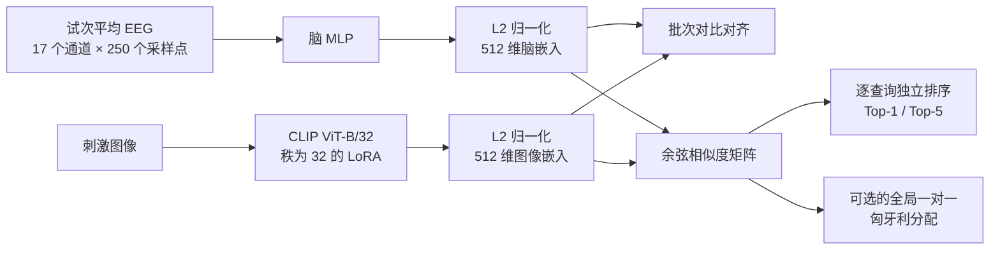

# 基于脑–视觉联合对齐的 EEG 图像检索

[English](README.md) | 简体中文

**AIAA3800 — 以人为中心的人工智能（Human-Centered Artificial Intelligence）**课程项目。

本仓库研究能否将非侵入式 EEG 记录映射到视觉语义嵌入空间，并用它检索受试者观看过的图像。正式标准协议覆盖 THINGS-EEG2 的全部十名受试者（`sub-01` 至 `sub-10`），并为每名受试者分别训练脑编码器与经过 LoRA 适配的 CLIP 视觉编码器。全局一对一匈牙利解码器仅保留为 `sub-08` 的传导式消融实验。

> **范围说明。** 标准 Top-1/Top-5 结果覆盖全部十名受试者，统一使用随机种子 `42`，并同时报告逐被试结果与十人汇总。每名受试者使用独立训练的模型。匈牙利结果仅涵盖 `sub-08`，不计入十人汇总。

## 项目亮点

- 将试次平均后的后部脑区 EEG 信号映射到 512 维 CLIP 图像空间。
- 联合训练脑 MLP 与 CLIP ViT-B/32 上秩为 32 的 LoRA 适配器。
- 对脑分支和视觉分支采用不同的学习率（TTUR 风格优化）。
- 为每名受试者报告固定的最终检查点结果，而不是选择测试集表现最好的 epoch。
- 对十名受试者分别训练和评估，并汇总标准 Top-1/Top-5。
- 为每个标准运行提供单元测试、独立检查点重载验证和逐查询预测，并为 `sub-08` 匈牙利消融保存相似度矩阵来源记录。

## 方法



对于 EEG 查询嵌入 $b_i$ 和图库图像嵌入 $v_j$，两者均经过 L2 归一化，检索分数为

$$
S_{ij} = b_i^\top v_j.
$$

标准检索对每一行独立排序：

$$
\hat{j}_i = \operatorname*{arg\,max}_{j} S_{ij}.
$$

可选的匈牙利解码器则求解一个全局双射：

$$
\hat{\pi} = \operatorname*{arg\,max}_{\pi \in \mathrm{Perm}(N)}
\sum_{i=1}^{N} S_{i,\pi(i)}.
$$

第二种协议优化的是完整的一对一匹配，因此可能为某个查询分配一个并非该查询行内最大值的图像。

## 已验证结果

### 十名受试者的标准独立检索

每名受试者均独立训练一个模型。正式结果使用第 25 个 epoch 后保存的固定检查点，并为每名受试者在 200 个留出查询和 200 张唯一图库图像上进行评估。每名受试者的两次全新保存/重载评估均得到完全一致的指标与逐查询预测。本次数组任务训练了 `sub-01`–`sub-07` 和 `sub-09`–`sub-10`；`sub-08` 复用此前在相同协议下完成并通过重复验证的运行。

| 受试者 | Top-1 | Top-5 | Top-1 正确数 | Top-5 正确数 |
|---|---:|---:|---:|---:|
| sub-01 | 86.0% | 96.5% | 172/200 | 193/200 |
| sub-02 | 90.5% | 100.0% | 181/200 | 200/200 |
| sub-03 | 85.0% | 97.0% | 170/200 | 194/200 |
| sub-04 | 83.5% | 97.0% | 167/200 | 194/200 |
| sub-05 | 84.0% | 98.0% | 168/200 | 196/200 |
| sub-06 | 94.0% | 99.5% | 188/200 | 199/200 |
| sub-07 | 86.0% | 98.0% | 172/200 | 196/200 |
| sub-08 | 91.0% | 99.5% | 182/200 | 199/200 |
| sub-09 | 82.5% | 98.0% | 165/200 | 196/200 |
| sub-10 | 91.0% | 99.5% | 182/200 | 199/200 |
| **十名受试者平均 / 合并计数** | **87.35%** | **98.30%** | **1747/2000** | **1966/2000** |

被试间总体标准差为 Top-1 3.74 个百分点、Top-5 1.19 个百分点。由于每名受试者均贡献 200 个查询，宏平均与合并准确率相同。包含 200 张候选图像时，随机基线为 Top-1 0.5%、Top-5 2.5%。

### `sub-08` 匈牙利一对一消融实验

| 评估协议（仅 `sub-08`） | Top-1 / 分配准确率 | Top-5 |
|---|---:|---:|
| 标准逐查询独立检索 | **182/200 (91.0%)** | **199/200 (99.5%)** |
| 全局匈牙利一对一分配 | **200/200 (100.0%)** | 不适用 |

### 如何理解匈牙利算法结果

匈牙利算法结果是一项**传导式闭集消融实验**，不能替代标准 Top-1：

- 它会联合观察完整的测试查询批次；
- 它假设 200 个查询与 200 张图库图像构成一个已知的双射；
- 每张图库图像都必须且只能使用一次；
- 一次全局分配只为每个查询返回一张图像，因此不存在可直接比较的 Top-5。

在 `sub-08` 的本次运行中，独立 Top-1 预测只覆盖了 183 张不同的图库图像。匈牙利解码改变了 18 个分配，将全部 18 个标准 Top-1 错误转换为正确匹配，同时没有把任何原本正确的匹配改错。预先声明的九种行/列排序产生了相同的映射分配，从而排除了依靠对齐顺序打破平局而得到 100% 结果的解释。

因此，推荐采用以下报告方式：

- **主要结果：**十名受试者标准平均 Top-1 87.35%、Top-5 98.30%，并同时报告上表中的逐被试结果、合并计数和总体标准差。
- **次要消融结果：**`sub-08` 的全局一对一分配准确率 100.0%，并与该被试的标准 Top-1 91.0%、Top-5 99.5% 对照。

任何十名受试者汇总分数均未使用匈牙利分配。

## 实验配置

| 组件 | 设置 |
|---|---|
| 数据集 | THINGS-EEG2 |
| 已验证受试者 / 随机种子 | `sub-01`–`sub-10`（分别训练） / `42` |
| 每名受试者加载后的训练 EEG 张量 | `(16540, 4, 63, 250)` |
| 每名受试者加载后的测试 EEG 张量 | `(200, 80, 63, 250)` |
| 试次处理 | 分别对 4 个训练试次和 80 个测试试次取平均 |
| EEG 通道 | `P7,P5,P3,P1,Pz,P2,P4,P6,P8,PO7,PO3,POz,PO4,PO8,O1,Oz,O2` |
| 时间窗口 | `[0, 250)` 个采样点 |
| 脑编码器 | 带残差投影块的 MLP |
| 视觉编码器 | CLIP ViT-B/32 |
| 视觉适配 | LoRA 秩 32，全部线性层 |
| 嵌入维度 | 512 |
| 脑分支 / 视觉分支学习率 | `5e-4` / `5e-5` |
| 调度器 / 权重衰减 | 余弦 / `0.05` |
| 训练 / 评估批次大小 | 512 / 100 |
| 训练 | 25 个 epoch、bf16、梯度检查点 |
| 评估范围 | 每名受试者 200 个查询 × 200 张图库图像（共 2,000 个查询） |
| 正式实验硬件 | 每个受试者任务使用一张 NVIDIA A40 |

## 仓库结构

```text
.
├── main/
│   ├── data.py                     # THINGS-EEG/图像加载和 ID 匹配
│   ├── models_brain.py             # EEG 编码器骨干网络
│   ├── models_clip.py              # 脑–CLIP 对齐模型
│   └── models_diffusion.py         # 实验性重建组件
├── scripts/
│   ├── evaluate_retrieval.py       # 标准评估与匈牙利评估
│   ├── aggregate_subject_metrics.py # 验证并汇总十名受试者指标
│   ├── finalize_results.py         # 标准结果验证/报告
│   ├── finalize_hungarian_results.py
│   ├── run_subject_reproduction.sh # 通用单受试者复现脚本
│   ├── run_sub08_reproduction.sh   # 旧版 Subject 08 专用脚本
│   ├── run_hungarian_evaluation.sh # 特定站点的匈牙利评估封装脚本
│   ├── submit_subject_array.slurm  # 十名受试者 SLURM 数组任务
│   └── submit_*.slurm              # 其他 HKUST(GZ) SLURM 启动脚本
├── tests/
│   └── test_hungarian_assignment.py
├── docs/                            # 内部技术说明
├── train_clip_lora.py               # 主要训练入口
├── vanilla.py                       # 实验性重建路径
├── enhance.py                       # 实验性检索优化
└── graph.py                         # 实验性图方法优化
```

生成的检查点、缓存、日志、计划和结果产物均通过 `.gitignore` 有意排除。

## 环境配置

请从仓库根目录运行本节中的命令。每个正式受试者任务使用 Linux、一张 NVIDIA A40，以及以下经过完整测试的软件栈：

| 软件包 | 已测试版本 |
|---|---:|
| Python | 3.10.20 |
| PyTorch | 2.11.0 + CUDA 12.8 |
| TorchVision | 0.26.0 + CUDA 12.8 |
| Transformers | 5.12.1 |
| Datasets | 5.0.0 |
| Accelerate | 1.14.0 |
| PEFT | 0.19.1 |
| Diffusers | 0.38.0 |
| Safetensors | 0.8.0 |
| NumPy | 2.2.6 |
| SciPy | 1.15.3 |
| Pillow | 12.2.0 |
| tqdm | 4.68.3 |
| einops | 0.8.2 |

`diffusers` 属于核心环境的一部分，因为即使仅运行检索，`main/models_clip.py` 也会导入其中的一个模型类。评估入口需要 SciPy，并使用它提供匈牙利算法求解器。

### 方案 A：复用已验证的集群环境

在项目集群上，`eeg_recon` 是生成所报告指标时使用的环境。如果当前 shell 中可以使用 Conda，可直接激活：

```bash
source "$(conda info --base)/etc/profile.d/conda.sh"
conda activate eeg_recon

python --version
which python
```

标准检索或匈牙利检索均无需额外安装依赖。不建议使用现有的 `test` 环境进行正式运行：其软件包版本与上表不同，而且目前在集群上存在 `libstdc++`/`GLIBCXX` 导入冲突。

若希望保持 `eeg_recon` 不变并创建一个独立工作副本：

```bash
conda create --name eeg-retrieval --clone eeg_recon -y
conda activate eeg-retrieval
```

### 方案 B：从零创建已测试环境

创建干净的 Conda 环境，先安装相匹配的 CUDA 12.8 PyTorch wheel，再安装其余固定版本的依赖：

```bash
conda create --name eeg-retrieval python=3.10.20 pip -y
conda activate eeg-retrieval
python -m pip install --upgrade pip

python -m pip install \
  torch==2.11.0 torchvision==0.26.0 \
  --index-url https://download.pytorch.org/whl/cu128

python -m pip install \
  transformers==5.12.1 \
  datasets==5.0.0 \
  accelerate==1.14.0 \
  peft==0.19.1 \
  diffusers==0.38.0 \
  safetensors==0.8.0 \
  numpy==2.2.6 \
  scipy==1.15.3 \
  Pillow==12.2.0 \
  tqdm==4.68.3 \
  einops==0.8.2
```

CUDA wheel 必须与目标机器的 NVIDIA 驱动兼容。如果 CUDA 12.8 不适用，请从[官方安装指南](https://pytorch.org/get-started/locally/)选择兼容的 PyTorch 构建，并保持其余软件包版本固定。不要混用各自独立选择的 PyTorch 和 TorchVision 构建。

### 验证安装

提交训练任务前，请运行以下导入检查：

```bash
python - <<'PY'
import sys

import accelerate
import datasets
import diffusers
import peft
import scipy
import torch
import torchvision
import transformers
from scipy.optimize import linear_sum_assignment

from main.models_clip import BrainCLIPModel

print("Python:", sys.version.split()[0])
print("PyTorch:", torch.__version__)
print("TorchVision:", torchvision.__version__)
print("Transformers:", transformers.__version__)
print("Datasets:", datasets.__version__)
print("Accelerate:", accelerate.__version__)
print("PEFT:", peft.__version__)
print("Diffusers:", diffusers.__version__)
print("SciPy:", scipy.__version__)
print("Compiled CUDA:", torch.version.cuda)
print("CUDA visible on this node:", torch.cuda.is_available())
if torch.cuda.is_available():
    print("GPU:", torch.cuda.get_device_name(0))
print("Core retrieval imports: OK")
PY

python -m unittest discover -s tests -v
```

如果登录节点没有分配 GPU，出现 `CUDA visible on this node: False` 属正常现象。训练前应在 SLURM GPU 分配中再次运行该检查；正式运行时应显示所分配的 A40。下方单 GPU 复现命令只使用一个 `torchrun` 进程，因此使用仓库中双进程 `accelerate_config.yaml` 执行 `accelerate launch` 并不等价。

### 可选的重建依赖

标准检索与匈牙利检索结果不依赖实验性重建工具。若要使用 `vanilla.py`、`enhance.py`、`graph.py` 或重建指标，还需安装：

```bash
python -m pip install \
  scikit-image==0.25.2 \
  clip-anytorch==2.6.0
```

这些路径还需要另外下载 SDXL/IP-Adapter 权重。Weights & Biases、SwanLab 或 TensorBoard 等实验跟踪器是可选项，仅在通过 `--report_to` 选择时才需要。

## 数据与预训练模型

本仓库不分发数据集和模型权重。

从 [THINGS initiative](https://things-initiative.org/) 或其 [OSF 仓库](https://osf.io/3jk45/)下载 THINGS-EEG2，然后准备加载器所需的 250 Hz 白化文件：

```text
things_eeg_data/
├── Preprocessed_data_250Hz_whiten/
│   ├── sub-01/
│   │   ├── train.pt
│   │   └── test.pt
│   ├── ...
│   └── sub-10/
│       ├── train.pt
│       └── test.pt
├── training_images/
│   └── **/*.jpg
└── test_images/
    └── **/*.jpg
```

CLIP 模型必须存放在本地兼容 Hugging Face 的目录中，该目录应包含配置、图像处理器与权重，例如：

```text
CLIP-ViT-B-32-laion2B-s34B-b79K/
├── config.json
├── preprocessor_config.json
└── model.safetensors
```

运行前设置可移植路径：

```bash
export PROJECT_ROOT="$(pwd)"
export THINGS_ROOT="/path/to/things_eeg_data"
export BRAIN_DIR="$THINGS_ROOT/Preprocessed_data_250Hz_whiten"
export CLIP_PATH="/path/to/CLIP-ViT-B-32-laion2B-s34B-b79K"
export SUBJECT_ID=1
printf -v SUBJECT_PADDED '%02d' "$SUBJECT_ID"
export OUTPUT_DIR="$PROJECT_ROOT/runs/all_subjects/seed42/subj${SUBJECT_PADDED}"
export RESULTS_DIR="$PROJECT_ROOT/results/all_subjects/seed42/subj${SUBJECT_PADDED}"
export CHANNELS="P7,P5,P3,P1,Pz,P2,P4,P6,P8,PO7,PO3,POz,PO4,PO8,O1,Oz,O2"

mkdir -p "$OUTPUT_DIR/cache" "$RESULTS_DIR"
```

如需完全离线运行：

```bash
export HF_DATASETS_OFFLINE=1
export TRANSFORMERS_OFFLINE=1
export HF_HUB_OFFLINE=1
export TOKENIZERS_PARALLELISM=false
export CUBLAS_WORKSPACE_CONFIG=:4096:8
```

## 训练

以下命令无需依赖特定站点封装脚本中的路径，即可复现一名受试者。正式十被试协议需要将 `SUBJECT_ID` 依次设为 1 至 10，并为每名受试者单独运行训练；不要把不同受试者合并到一个模型中。

```bash
torchrun --standalone --nnodes=1 --nproc-per-node=1 \
  train_clip_lora.py \
  --dataset_name things \
  --brain_directory "$BRAIN_DIR" \
  --image_directory "$THINGS_ROOT" \
  --cache_dir "$OUTPUT_DIR/cache" \
  --subject_ids "$SUBJECT_ID" \
  --eval_subject_ids "$SUBJECT_ID" \
  --brain_column eeg \
  --brain_backbone brain_mlp \
  --dropout 0.1 \
  --pretrained_model_name_or_path "$CLIP_PATH" \
  --lora_rank 32 \
  --lora_layers all-linear \
  --gradient_checkpointing \
  --time_slice 0,250 \
  --avg_trials \
  --selected_channels "$CHANNELS" \
  --learning_rate 5e-4 \
  --vision_learning_rate 5e-5 \
  --lr_scheduler_type cosine \
  --weight_decay 0.05 \
  --seed 42 \
  --dataloader_num_workers 8 \
  --mixed_precision bf16 \
  --output_dir "$OUTPUT_DIR" \
  --metrics_jsonl "$OUTPUT_DIR/validation_metrics.jsonl" \
  --save_total_limit 1 \
  --checkpointing_steps epoch \
  --validation_steps epoch \
  --num_train_epochs 25 \
  --per_device_train_batch_size 512 \
  --per_device_eval_batch_size 100
```

通用封装脚本可以执行 smoke test，也可以执行 25 epochs 的正式训练并随后进行两次全新的 checkpoint 重载评估。默认情况下它会拒绝覆盖已有正式运行：

```bash
bash scripts/run_subject_reproduction.sh smoke --subject-id 1
bash scripts/run_subject_reproduction.sh formal --subject-id 1
```

如果使用新硬件或新准备的数据集，请在正式任务前先运行 smoke test。

## 评估

在 Bash 中定义通用评估参数：

```bash
EVAL_ARGS=(
  --brain-model-path "$OUTPUT_DIR/brain_model"
  --vision-adapter-path "$OUTPUT_DIR/vision_model"
  --pretrained-model-name-or-path "$CLIP_PATH"
  --brain-directory "$BRAIN_DIR"
  --image-directory "$THINGS_ROOT"
  --dataset-name things
  --subject-id "$SUBJECT_ID"
  --selected-channels "$CHANNELS"
  --time-slice 0,250
  --batch-size 100
  --num-workers 0
  --device cuda
  --dtype bf16
  --cache-dir "$OUTPUT_DIR/cache"
  --seed 42
  --expected-num-samples 200
  --local-files-only
)
```

### 标准独立检索

```bash
python scripts/evaluate_retrieval.py \
  "${EVAL_ARGS[@]}" \
  --metrics-output "$RESULTS_DIR/sub${SUBJECT_PADDED}_seed42_formal_metrics.json" \
  --predictions-output "$RESULTS_DIR/sub${SUBJECT_PADDED}_seed42_formal_predictions.csv"
```

### 匈牙利一对一消融实验

该消融仅在 `sub-08` 上完成验证。请先设置 `SUBJECT_ID=8`、重新计算 `SUBJECT_PADDED=08`，将 `OUTPUT_DIR` 和 `RESULTS_DIR` 指向该受试者的运行目录，然后重新执行上方完整的 `EVAL_ARGS=(...)` 定义，使 Bash 数组捕获更新后的值。评估器仍会写出标准逐查询指标，同时增加独立的受约束分配命名空间和 CSV：

```bash
python scripts/evaluate_retrieval.py \
  "${EVAL_ARGS[@]}" \
  --enable-hungarian \
  --metrics-output "$RESULTS_DIR/sub08_hungarian_metrics.json" \
  --predictions-output "$RESULTS_DIR/sub08_hungarian_standard_predictions.csv" \
  --hungarian-output "$RESULTS_DIR/sub08_hungarian_assignment.csv" \
  --similarity-output "$RESULTS_DIR/sub08_cosine_similarity.npz"
```

不要把 `assignment_accuracy` 标记为标准 Top-1，也不要为单次全局分配虚构匈牙利 Top-5。

## 测试

```bash
python -m unittest -v tests/test_hungarian_assignment.py
```

这些测试涵盖求解器最优性、冲突消解、无效矩阵、非对角 ID 映射，以及唯一最优解下的行/列置换不变性。

## SLURM 封装脚本

仓库包含在 HKUST(GZ) 集群上使用的启动脚本：

```bash
# 全部十名受试者的标准运行；数组最多同时运行两个任务。
sbatch scripts/submit_subject_array.slurm smoke
sbatch scripts/submit_subject_array.slurm formal

# Subject 08 专用旧版/匈牙利启动脚本。
sbatch scripts/submit_sub08.slurm formal
sbatch scripts/submit_hungarian_eval.slurm
```

全部十名受试者的标准运行完成后，执行验证与汇总：

```bash
python scripts/aggregate_subject_metrics.py \
  --results-root "$PROJECT_ROOT/results/all_subjects/seed42" \
  --subjects 1-10 \
  --seed 42 \
  --expected-epochs 25
```

聚合器会检查 query/gallery 数量、25 条验证记录、指标与正确数是否一致、两次重载预测是否完全相同、检索协议、已保存模型配置、CLIP 基座路径以及关键环境版本。它会在 `results/all_subjects/seed42/` 下生成 `summary.json`、`per_subject_metrics.csv`、`RESULTS_EN.md` 和 `RESULTS_ZH.md`。

这些 shell 与 SLURM 文件目前包含特定站点的绝对路径。在其他克隆或集群中使用前，请更新：

- `PROJECT_ROOT`、`THINGS_ROOT`、`BRAIN_DIR` 和 `CLIP_PATH`；
- `#SBATCH --chdir`、`--output` 和 `--error`；
- Conda 激活路径与环境名称；
- 分区、GPU、CPU、内存和时间请求。

前文给出的直接训练和评估命令是可移植的参考命令。

## 可复现性政策

- 正式指标使用第 25 个 epoch 后的固定最终检查点进行评估。
- 测试集峰值 epoch 仅用于诊断，不用于选择检查点。
- 十名受试者使用不同模型，不进行跨被试合并或联合训练。
- 查询与图库身份通过唯一图像 ID 匹配，而不是假定目标位于对角线上。
- 每个标准评估均在独立重新加载模型后重复执行。
- 十名受试者汇总只包含标准独立 Top-1/Top-5。
- `sub-08` 匈牙利评估会保存完整相似度矩阵、ID 顺序、哈希、转换记录和分配输出。
- 真实标签仅在求解分配后使用，不属于匈牙利目标函数的一部分。
- 审计多种预先声明的行/列顺序，确保输入的对齐顺序无法在完全平局时静默决定结果。

## 局限性与负责任使用

- 当前结果覆盖 THINGS-EEG2 全部十名受试者，但仅使用一个随机种子，因此未量化跨随机种子不确定性。
- 每名受试者使用独立模型；本实验不评估跨被试泛化。
- 本次复现所用训练循环在 `backward()` 之前调用梯度裁剪，因此配置的最大梯度范数不会影响这些运行。十名受试者均沿用同一行为；修正调用顺序会形成不同协议，并需要完整重跑。
- 试次平均使用了重复呈现的数据，并不等价于单试次解码。
- 匈牙利消融仅在 `sub-08` 上验证，不能外推到全部十名受试者。它还需要完整的查询批次和已知的一对一图库先验，因此不是在线单查询检索协议。
- 数据集、预处理和模型权重的版本可能显著影响结果。
- 重建路径仍处于实验阶段；本 README 不声称任何正式的重建指标。
- EEG 属于敏感的人类受试者数据。请遵守数据集关于知情同意、隐私、许可和再分发的要求，且不要将本研究系统解释为临床或诊断工具。

## 参考文献

- Gifford, A. T., Dwivedi, K., Roig, G., & Cichy, R. M. (2022). [A large and rich EEG dataset for modeling human visual object recognition](https://doi.org/10.1016/j.neuroimage.2022.119754). *NeuroImage, 264*, 119754.
- Song, Y., Liu, B., Li, X., Shi, N., Wang, Y., & Gao, X. (2024). [Decoding Natural Images from EEG for Object Recognition](https://openreview.net/forum?id=dhLIno8FmH). *ICLR 2024*. 代码：[NICE-EEG](https://github.com/eeyhsong/NICE-EEG)。
- Li, D., Wei, C., Li, S., Zou, J., & Liu, Q. (2024). [Visual Decoding and Reconstruction via EEG Embeddings with Guided Diffusion](https://proceedings.neurips.cc/paper_files/paper/2024/hash/ba5f1233efa77787ff9ec015877dbd1f-Abstract-Conference.html). *NeurIPS 2024*. 代码：[EEG Image Decode](https://github.com/dongyangli-del/EEG_Image_decode)。

## 许可证

本课程项目仓库尚未声明开源许可证。重新分发代码或接受外部贡献前，请添加明确的许可证。
